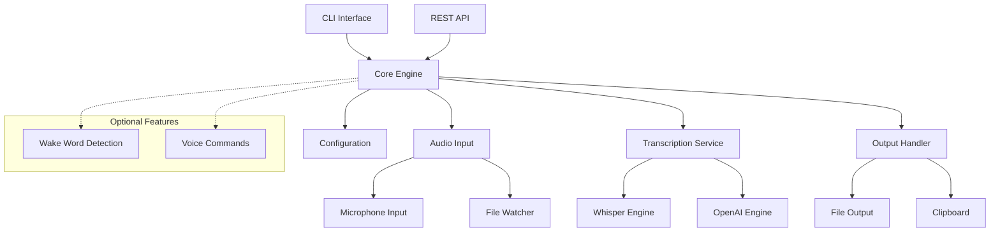

# Design Document

## Overview

This design document outlines the refactoring approach for the Scribed audio transcription daemon. Based on analysis of the current codebase, we'll transform it from a sprawling collection of features into a focused, maintainable Python project centered around real-time microphone transcription with essential supporting features.

## Architecture

### Current State Analysis

The existing codebase contains:
- **Core functionality**: Audio transcription with multiple engines (Whisper, OpenAI, SpeechLM2)
- **Real-time features**: Wake word detection, microphone input, power words (voice commands)
- **Batch processing**: File watching and batch transcription
- **Infrastructure**: REST API, CLI, configuration management
- **Sprawl indicators**: Multiple test files, numerous fix summaries, duplicate functionality

### Target Architecture



## Components and Interfaces

### 1. Core Engine (`scribed.core`)

**Purpose**: Central orchestrator that manages the transcription workflow

**Key Classes**:
- `ScribedEngine`: Main engine class
- `TranscriptionSession`: Manages individual transcription sessions

**Responsibilities**:
- Coordinate audio input, transcription, and output
- Manage session lifecycle
- Handle errors and logging

### 2. Audio Input (`scribed.audio`)

**Purpose**: Handle different audio input sources

**Key Classes**:
- `AudioSource` (abstract base)
- `MicrophoneSource`: Real-time microphone input
- `FileSource`: File-based input
- `FileWatcher`: Monitor directories for new files

**Interface**:
```python
class AudioSource:
    async def start(self) -> None: ...
    async def stop(self) -> None: ...
    async def read_chunk(self) -> AudioChunk: ...
```

### 3. Transcription Service (`scribed.transcription`)

**Purpose**: Abstract transcription engines and provide unified interface

**Key Classes**:
- `TranscriptionEngine` (abstract base)
- `WhisperEngine`: Local Whisper transcription
- `OpenAIEngine`: OpenAI API transcription
- `TranscriptionService`: Engine manager

**Interface**:
```python
class TranscriptionEngine:
    async def transcribe(self, audio: AudioData) -> TranscriptionResult: ...
    def is_available(self) -> bool: ...
```

### 4. Configuration (`scribed.config`)

**Purpose**: Simplified configuration management

**Key Classes**:
- `Config`: Main configuration class
- `AudioConfig`: Audio-specific settings
- `TranscriptionConfig`: Transcription engine settings

**Simplified Structure**:
```yaml
# Core settings
audio:
  source: microphone  # or file
  microphone:
    device_index: null
    sample_rate: 16000
  file_watcher:
    watch_directory: ./audio_input
    output_directory: ./transcripts

transcription:
  provider: whisper  # or openai
  model: base
  language: en

output:
  format: txt
  save_to_file: true
  copy_to_clipboard: false

# Optional features (disabled by default)
wake_word:
  enabled: false
  keywords: [porcupine]

power_words:
  enabled: false
  mappings: {}
```

### 5. Output Handler (`scribed.output`)

**Purpose**: Handle transcription output in various formats

**Key Classes**:
- `OutputHandler`: Manages output destinations
- `FileOutput`: Save to files
- `ClipboardOutput`: Copy to clipboard

## Data Models

### Core Data Types

```python
@dataclass
class AudioChunk:
    data: bytes
    sample_rate: int
    channels: int
    timestamp: float

@dataclass
class TranscriptionResult:
    text: str
    confidence: float
    segments: List[TranscriptionSegment]
    processing_time: float
    status: TranscriptionStatus

@dataclass
class TranscriptionSegment:
    text: str
    start_time: float
    end_time: float
    confidence: float
```

### Configuration Models

Using Pydantic for validation:
```python
class AudioConfig(BaseModel):
    source: Literal["microphone", "file"] = "microphone"
    microphone: MicrophoneConfig = MicrophoneConfig()
    file_watcher: FileWatcherConfig = FileWatcherConfig()

class TranscriptionConfig(BaseModel):
    provider: Literal["whisper", "openai"] = "whisper"
    model: str = "base"
    language: str = "en"
    api_key: Optional[str] = None
```

## Error Handling

### Error Categories

1. **Configuration Errors**: Invalid settings, missing files
2. **Audio Errors**: Device not found, permission issues
3. **Transcription Errors**: Engine failures, API errors
4. **Output Errors**: File write failures, clipboard issues

### Error Handling Strategy

```python
class ScribedError(Exception):
    """Base exception for Scribed errors"""
    pass

class AudioError(ScribedError):
    """Audio input/output related errors"""
    pass

class TranscriptionError(ScribedError):
    """Transcription engine related errors"""
    pass

class ConfigurationError(ScribedError):
    """Configuration related errors"""
    pass
```

### Graceful Degradation

- If clipboard fails, continue with file output
- If preferred transcription engine fails, try fallback
- If wake word detection fails, continue with manual activation

## Testing Strategy

### Test Structure

```
tests/
├── unit/
│   ├── test_config.py
│   ├── test_audio.py
│   ├── test_transcription.py
│   └── test_output.py
├── integration/
│   ├── test_end_to_end.py
│   └── test_api.py
└── fixtures/
    ├── audio_samples/
    └── config_examples/
```

### Test Categories

1. **Unit Tests**: Individual component testing
2. **Integration Tests**: End-to-end workflow testing
3. **Mock Tests**: External service mocking
4. **Performance Tests**: Resource usage validation

### Test Data Strategy

- Use synthetic audio for consistent testing
- Mock external APIs (OpenAI) for reliability
- Provide sample configurations for different use cases

## Migration Strategy

### Phase 1: Core Refactoring
1. Extract core engine from daemon
2. Simplify configuration structure
3. Consolidate audio input handling
4. Clean up transcription service interface

### Phase 2: Feature Consolidation
1. Merge duplicate functionality
2. Remove unused features
3. Simplify CLI interface
4. Update documentation

### Phase 3: Optional Features
1. Make wake word detection truly optional
2. Simplify power words implementation
3. Add feature flags for experimental functionality

### Backward Compatibility

- Maintain existing CLI commands
- Provide configuration migration script
- Keep core API endpoints functional
- Document breaking changes clearly

## Removed/Simplified Features

### Features to Remove
- Multiple TTS engines (keep one working implementation)
- Complex audio preprocessing (keep basic functionality)
- SpeechLM2 integration (too complex for core use case)
- GUI components (focus on CLI/API)

### Features to Simplify
- Power words: Basic command mapping only
- Wake word: Single engine (Picovoice)
- API: Essential endpoints only
- Configuration: Flatten nested structures

### Features to Keep
- Real-time microphone transcription
- File batch processing
- Whisper and OpenAI transcription engines
- Basic output formatting (txt, clipboard)
- CLI interface
- REST API for integration

## Performance Considerations

### Resource Management
- Limit concurrent transcription jobs
- Implement audio buffer management
- Add memory usage monitoring
- Provide CPU usage controls

### Optimization Targets
- Startup time < 3 seconds
- Real-time transcription latency < 1 second
- Memory usage < 500MB for typical workloads
- Support for 8+ hour continuous operation

## Security Considerations

### Voice Commands (Power Words)
- Disabled by default
- Explicit whitelist approach
- Command length limits
- Dangerous keyword detection
- Confirmation requirements

### API Security
- Local-only binding by default
- Optional authentication for remote access
- Rate limiting for API endpoints
- Input validation for all endpoints

### Data Privacy
- Local processing by default
- Clear indication when using cloud APIs
- No persistent audio storage
- Optional transcription logging